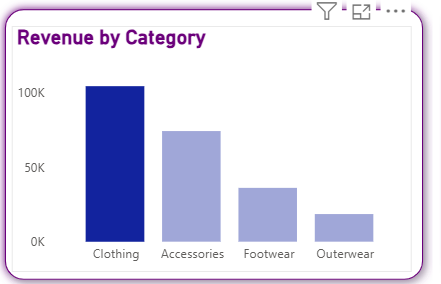

# 📊 CUSTOMER BEHAVIOUR ANALYSIS

## 📊 Customer Behaviour Analytics Dashboard

A **data-driven analytics project** that analyzes customer behaviour using **Python for data processing** and **Power BI for interactive visualization**.  
This dashboard helps businesses understand customer patterns, preferences, and trends to support **data-driven decision-making**.

---

## 🚀 Project Overview

Customer behaviour analysis plays a crucial role in improving **customer retention, personalization, and sales strategy**.

This project focuses on:
- Cleaning and transforming raw customer data using Python
- Performing exploratory data analysis (EDA)
- Building an interactive Power BI dashboard
- Generating actionable business insights for stakeholders

---

## 🛠️ Tech Stack

### 🔹 Programming & Analysis
- **Python**
  - Pandas
  - NumPy
  - Matplotlib
  - Seaborn

### 🔹 Visualization
- **Power BI**
  - Data Modeling
  - DAX Measures
  - Interactive Dashboards

### 🔹 Data Source
- CSV files / SQL Database (customizable)
Customer-Behaviour-Analysis/
│
├── data/
│ ├── raw_data.csv
│ └── processed_data.csv
│
├── notebooks/
│ └── customer_behavior_analysis.ipynb
│
├── scripts/
│ └── data_preprocessing.py
│
├── powerbi/
│ └── Customer_Behaviour_Dashboard.pbix
│
├── images/
│ ├── dashboard_overview.png
│ ├── customer_segmentation.png
│ ├── revenue_trends.png
│ └── purchase_frequency.png
│
├── requirements.txt
└── README.md

---

## 🔄 Data Pipeline

1. **Data Collection**
   - Customer demographics
   - Transaction history
2. **Data Cleaning & Transformation**
   - Handling missing values
   - Removing duplicates
   - Feature engineering
3. **Exploratory Data Analysis (EDA)**
   - Customer segmentation
   - Purchase behavior analysis
   - Revenue contribution
4. **Dashboard Development**
   - KPI cards
   - Trend analysis
   - Segmentation visuals

---

## 📈 Dashboard Features

- 📌 Total Customers KPI
- 📌 Customer Segmentation Analysis
- 📌 Purchase Frequency Insights
- 📌 Revenue & Sales Trends
- 📌 Top Products & Categories
- 📌 Customer Retention Metrics

---

## 🖼️ Dashboard Screenshots

### 🔹 Dashboard Overview


### 🔹 Customer Segmentation


### 🔹 Revenue Trends


### 🔹 Purchase Frequency Analysis


> 📌 *All visuals are created using Power BI with interactive slicers and DAX measures.*

---

## ▶️ How to Run the Project

### 1️⃣ Clone the Repository
```bash
git clone https://github.com/your-username/customer-behaviour-analysis.git
cd customer-behaviour-analysis

---

## 📂 Project Structure

